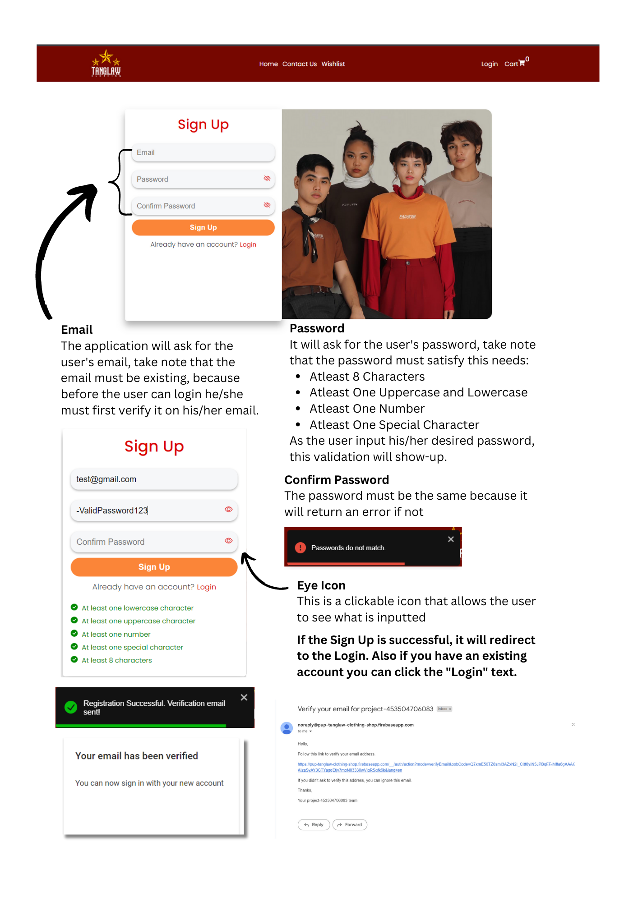
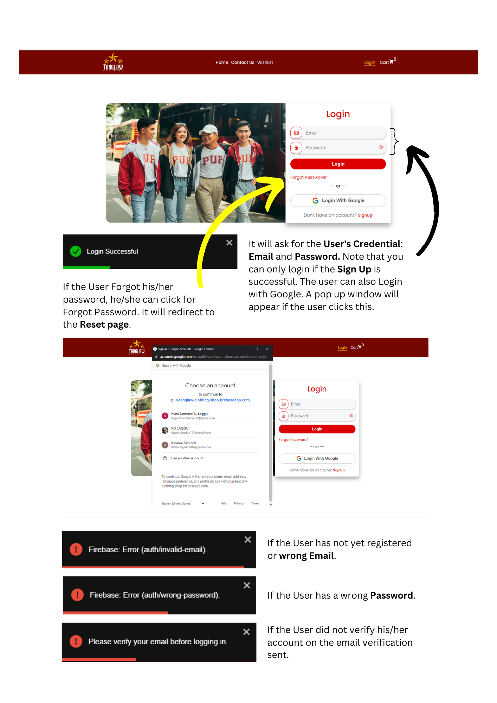
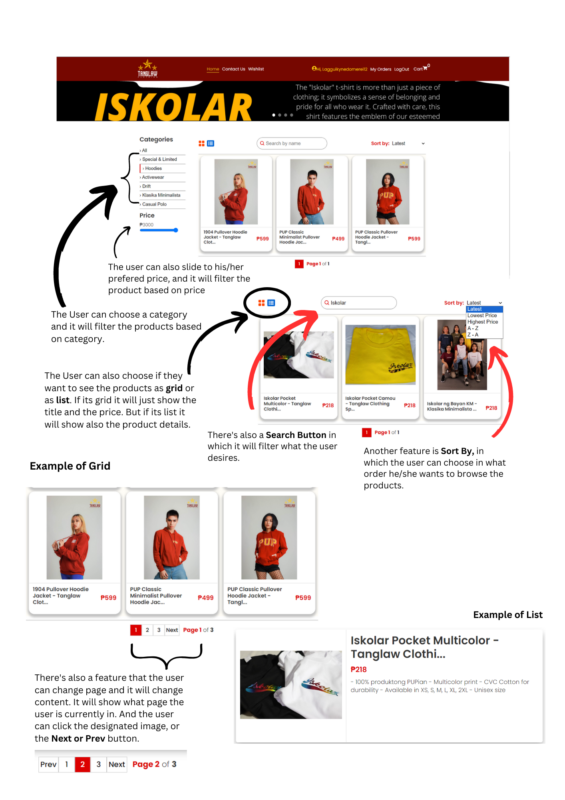
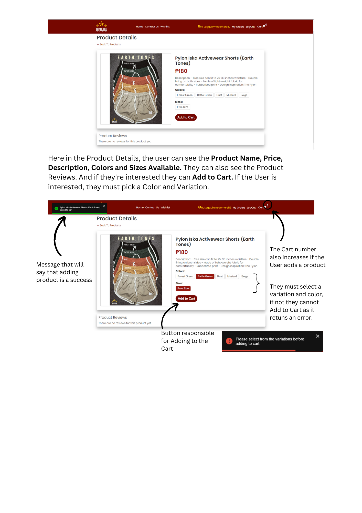
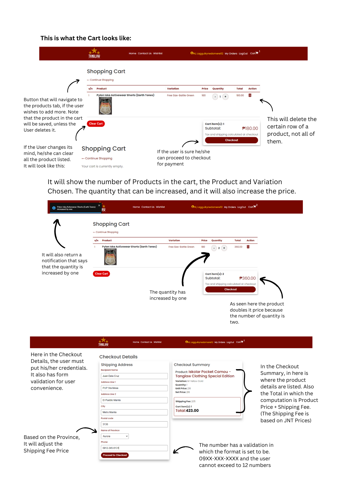
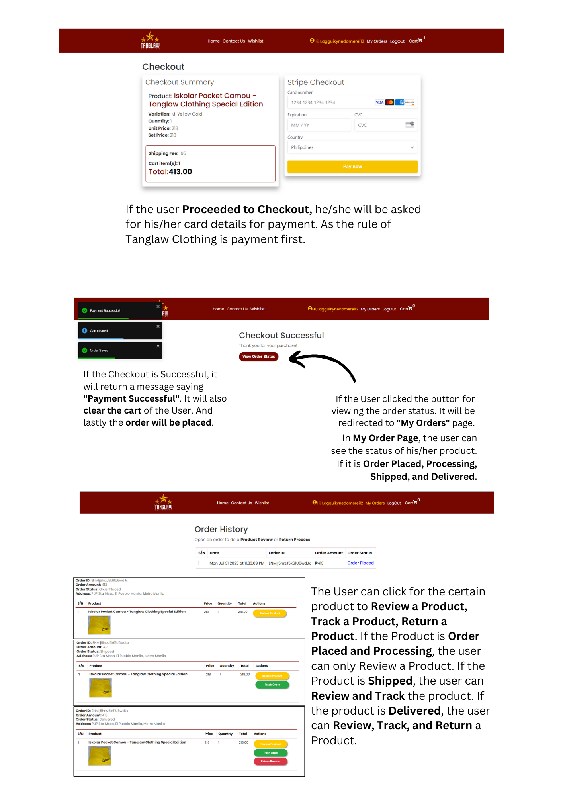
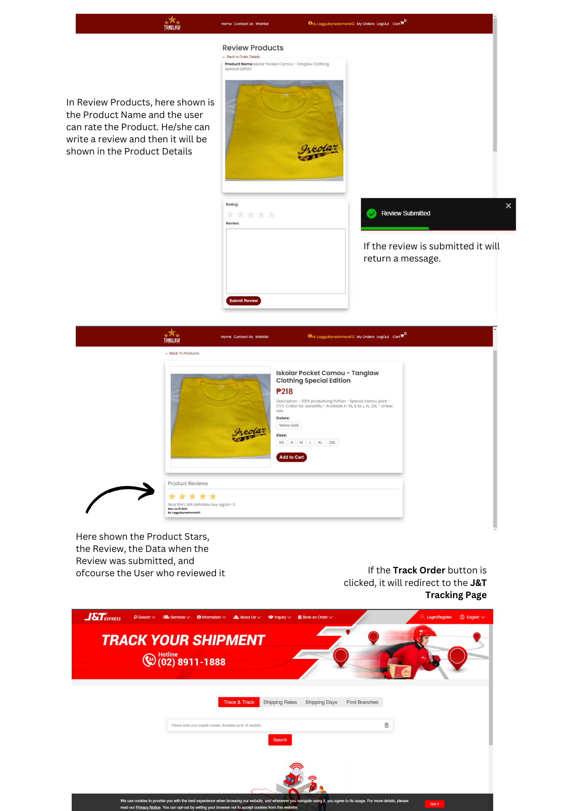
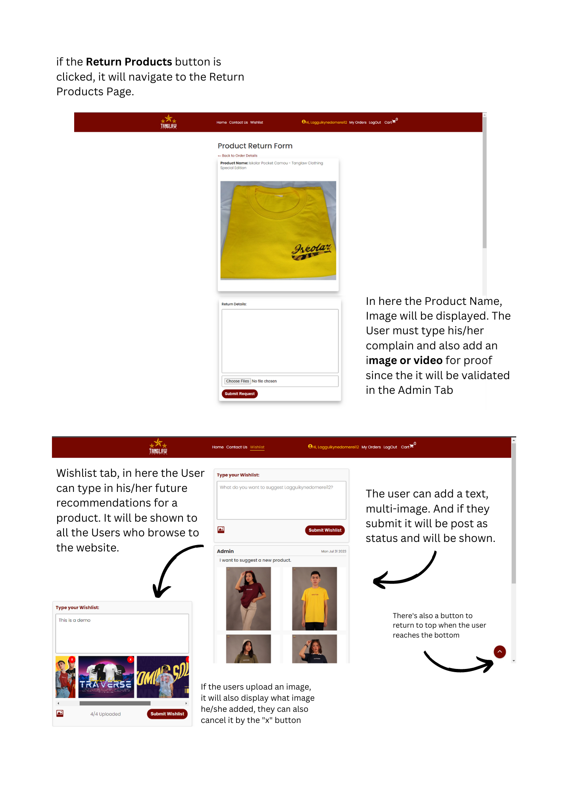
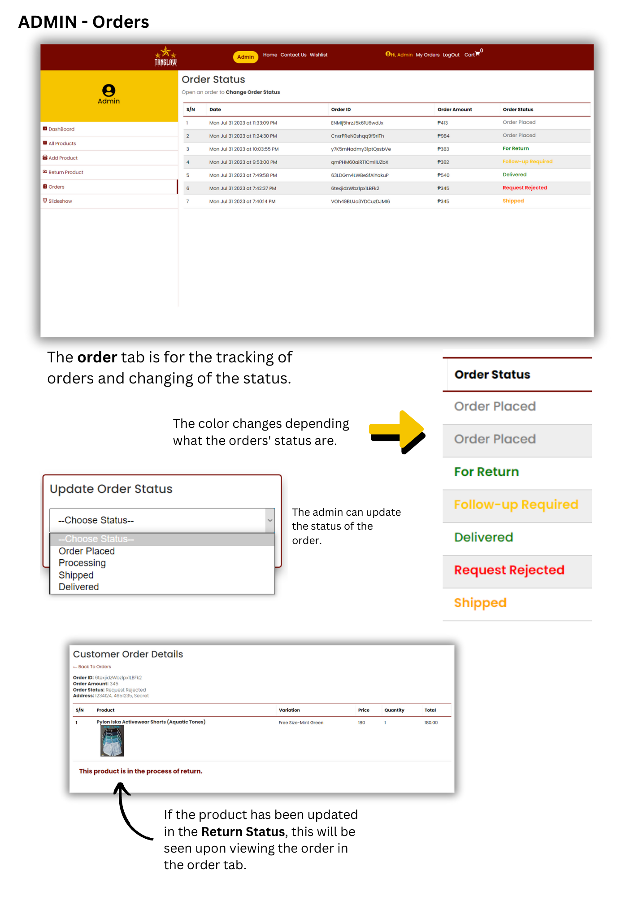

The Tanglaw Clothing E-Commerce Store is a web-based application that
facilitates the management of an online store. It provides functionalities for
both customers and administrators to perform various tasks related to product
browsing, ordering, product and order management, and more. The system
aims to improve the efficiency of running an online store while enhancing the
shopping experience for customers.

[View Website Here](https://tanglaw-clothing.onrender.com/)

__3.1 Customer Module__
* User registration and login
* Reset password
* Browse products by category and search
* View product details and images
* Add products to the shopping cart
* Update cart contents
* Proceed to checkout and place orders
* View order status
* Track orders
* Review products
* Request for product returns
* Contact support
* Suggest future products to the store via wishlist

__3.2 Admin Module__
* Admin login to access the admin dashboard
* Manage products (add, edit, delete)
* View and process customer orders
* View and process product returns
* Manage slideshow in home display
* Generate sales reports

### `npm run dev`
To start the application both in Client side and Server Side

